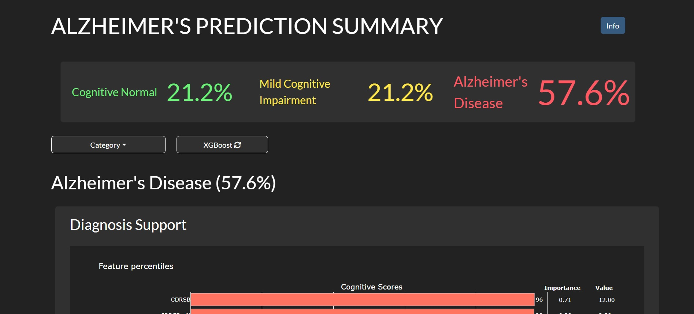

# Enhancing Explainability in Multimodal Decision Support Systems  
**A Framework for Transparent AI Integration in Healthcare**

**Author:** Èric Sánchez López  
**Program:** Advanced Master’s degree in Artificial Intelligence, KU Leuven  

---

## Abstract

This thesis presents a transparent, on-device decision support system for Alzheimer's Disease prediction that integrates multimodal data processing, explainable modelling and interactive visualisations. A collection of 453 samples was processed by early-fusing ADNI clinical records with FastSurfer-derived MRI region statistics, followed by handling of missing values and feature redundancy to extract 218 clinically meaningful and understandable predictors. Decision Tree, Random Forest (RF) and XGBoost (XGB) classifiers were trained and compared across ablated data subsets, where RF and XGB obtain the highest accuracy (0.89) after evaluating on a stratified 10-fold validation. The ablation study confirmed that cognitive assessments are crucial for Mild Cognitive Impairment detection, while imaging data alone lacks sensitivity.

To ease clinician interaction, the results are displayed in an interactive Dash dashboard that shows prediction probabilities, feature values on population distributions, MRI slice-view importance maps, and decision-path explanations, alongside natural-language summaries generated by a Small Language Model (SLM). All the process, although lengthy (15 to 20 minutes on CPU), ensures data privacy by running on-device, aligning with Trustworthy AI principles.



---

## Repository Structure

```
.
├── 01_analysis_and_modeling.ipynb   # Data ingestion, EDA, model training/optimisation & evaluation
├── 02_dashboard.ipynb               # Dash-based dashboard for visualising and interpreting results
├── 03_lm_sft.ipynb                  # Supervised fine-tuning pipeline for a language model
└── assets/                          # Dashboard's style and DT SVG files.
```

---

## Notebooks Overview

### 01_analysis_and_modeling.ipynb
- **Purpose:**
  - Data preprocessing 
  - Exploratory Data Analysis (EDA)
  - Model definition  
  - Hyperparameter tuning & evaluation  
  - Explainability methods (SHAP, importance maps)

### 02_dashboard.ipynb
- **Purpose:**  
  - Dash application for interactive result visualisation  
  - User-friendly interface for clinicians to explore predictions and explanations

### 03_lm_sft.ipynb
- **Purpose:**
  - Dataset creation from Gemini, training loop, validation, and checkpointing
  - Supervised fine-tuning pipeline for a pretrained language model
  - Feature name appearance: precision and recall metric computation

---

## Data structure

Tabular data merged with FastSurfer statistics is loaded from the path `"../ADNI_Processed/augmented_ADNIMERGE_v1.csv"`.

Results are written to `"./results/{patient_id}"` where `patient_id` is determined from the data's `PTID` column.

In the dashboard, the patient's ID can be specified in the first cell of the notebook. The model is loaded from the weights in a folder named `lfm2-sft/` in the same directory.

---

## License

This project is licensed under the MIT License. See the `LICENSE` file for details.

---

## Contact

**Èric Sánchez López**  
- Email: ericsanlopez@gmail.com
- LinkedIn: [https:/linkedin.com/in/ericsanlopez](https:/linkedin.com/in/ericsanlopez)


